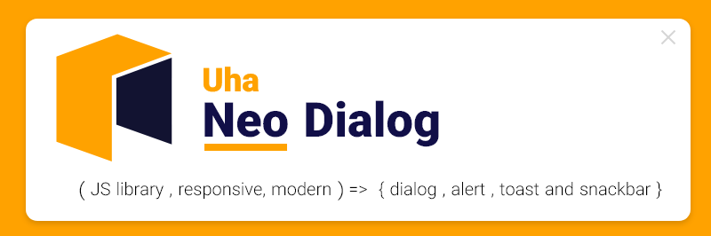
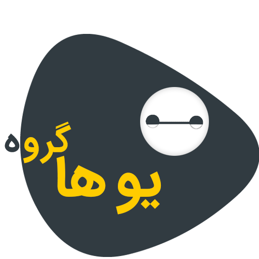

# Neo Dialog

**NeoDialog = ( responsive, modern ) => { dialog , alert , toast and snackbar }**

---

### [Getting Start](https://neodialog.github.io/doc/#start) | [Browsers](https://neodialog.github.io/doc/#Browsers) | [Options](https://neodialog.github.io/doc/#Options) | [Icons](https://neodialog.github.io/doc/#Icons) | [Buttons](https://neodialog.github.io/doc/#Buttons) | [Inputs](https://neodialog.github.io/doc/#Inputs) | [Custom](https://neodialog.github.io/doc/#Custom) | [Examples](https://neodialog.github.io/doc/#Examples) )

---
**Uha Group**

